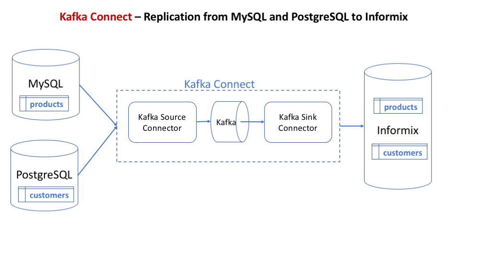

# Replication from MySQL, PostgreSQL to Informix.

Demo to replicate products table from MySQL, customers table from PostgreSQL to Informix database.

Architecture Diagram:

## Demo steps

1. Start containers.

   docker-compose up

2. Create testdb database, customer and products tables at Informix

   docker-compose exec informix bash -c '/docker-entrypoint-initdb.d/schema.sh'

3. Register kafka Source and Sink connectors with kafka-connect-01 container.
   
   docker-compose exec  kafka-connect-01 bash -c '/docker-entrypoint-initdb.d/connectors.sh'

   Note: this creates two source connectors and two sink connectors.

4. Connect to MySQL database and insert data into products table.

   docker-compose exec mysql bash -c '/docker-entrypoint-initdb.d/insert'

5. Connect to Informix database and verify whether products table data replicated from MySQL.
   
   docker-compose exec informix bash -c '/docker-entrypoint-initdb.d/select.sh'

6. Connect to PostgreSQL database and insert data into customers table.
   
   docker-compose exec postgres bash -c '/docker-entrypoint-initdb.d/insert'

5. Connect to Informix database and verify whether customers table data replicated from PostgreSQL.
   
   docker-compose exec informix bash -c '/docker-entrypoint-initdb.d/select.sh'

